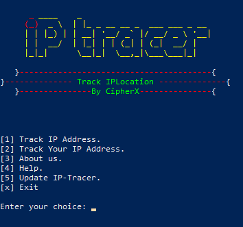

# IP-Tracer

IP-Tracer is a simple and powerful tool for tracing IP addresses. It provides geolocation details, domain name information, and helps users identify the origin of an IP address.

---

## Features
- Track geolocation of any IP address.
- Display your own public IP address and its location.
- Fetch details like country, region, city, zip code, ISP, organization, and coordinates (latitude & longitude).
- Simple and interactive menu.
- Easy-to-use interface with a terminal-based logo.

---

## Screenshot



---

## Prerequisites
To use IP-Tracer, ensure you have the following installed:
- **Python 3.x**
- **Git** (for updates)
- **Requests** library: Install it via pip: `pip install requests`

---

## Installation
1. Clone this repository:
   ```bash
   git clone https://github.com/YassineDouadi/IP_Tracer.git
   cd IP-Tracer
   pip install -r requirements.txt
   python3 IP_Tracer.py

